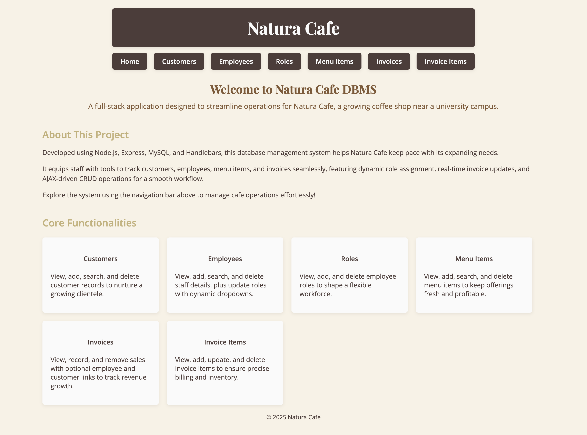
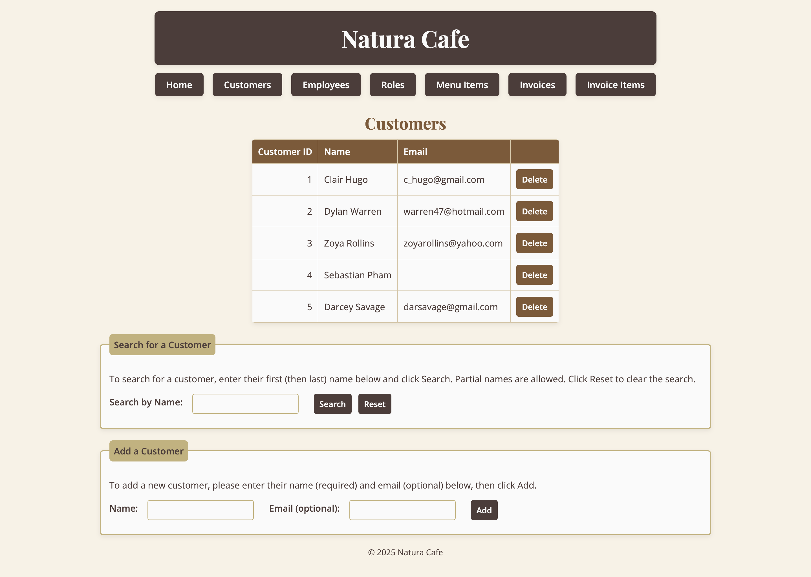
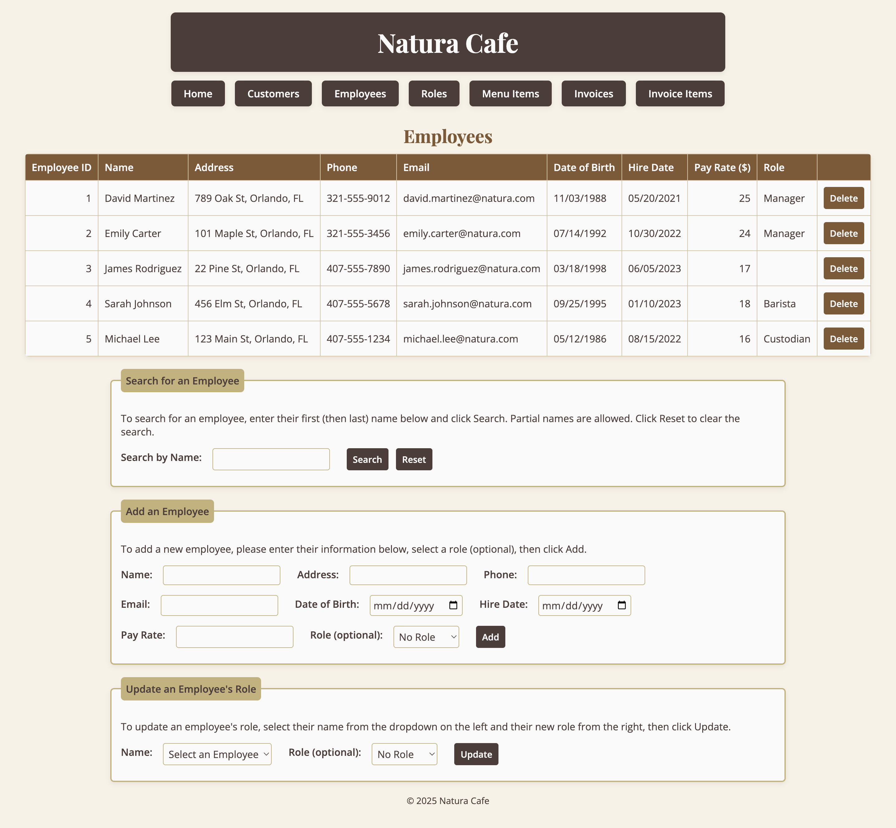
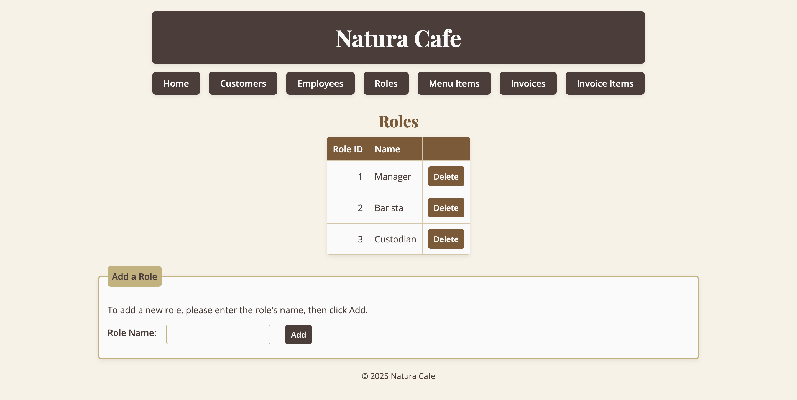
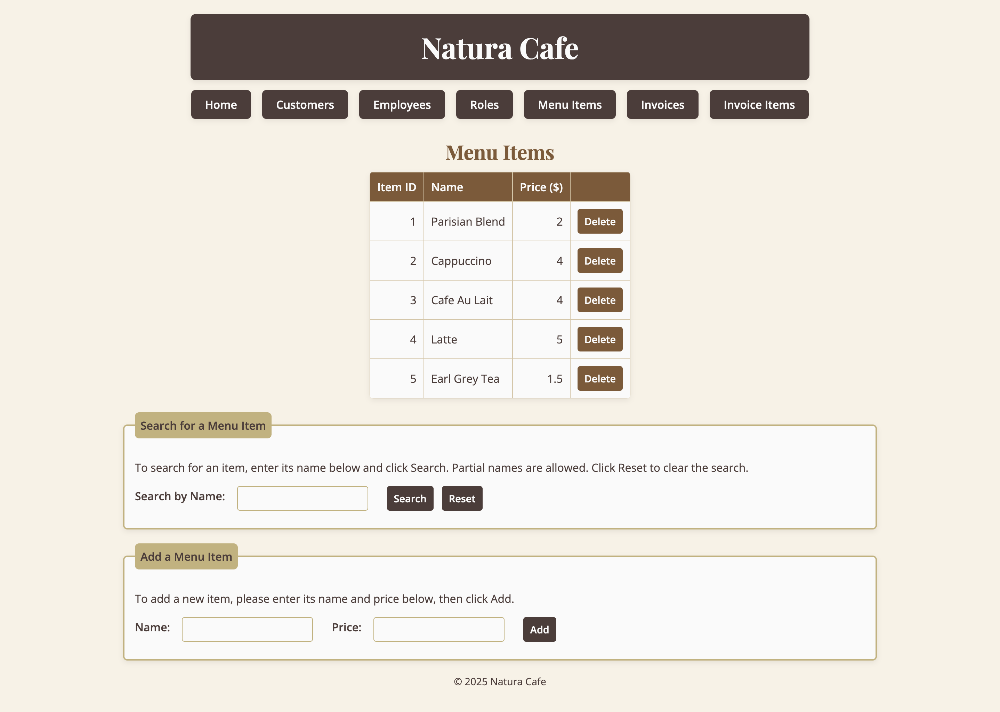
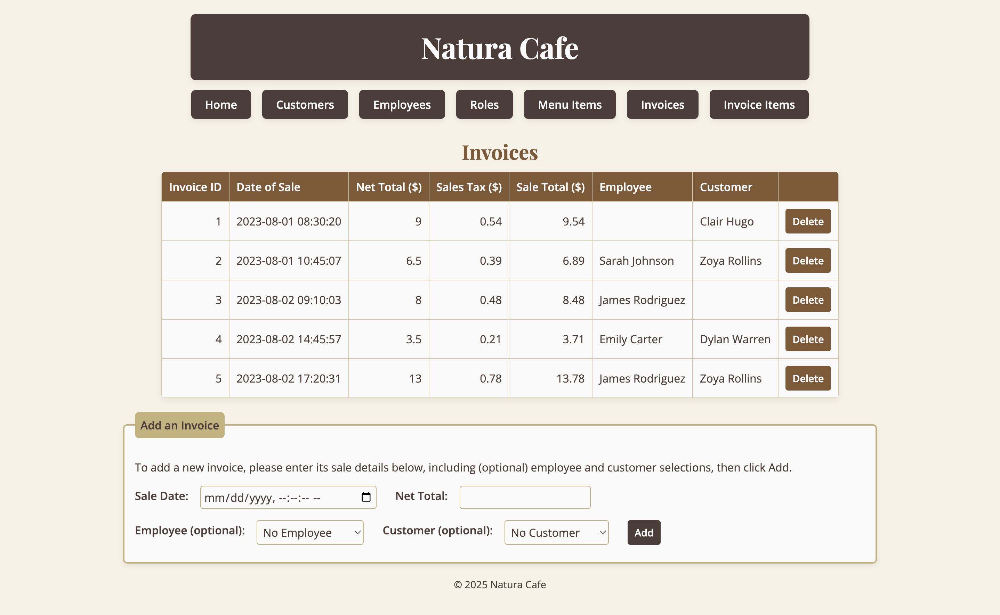
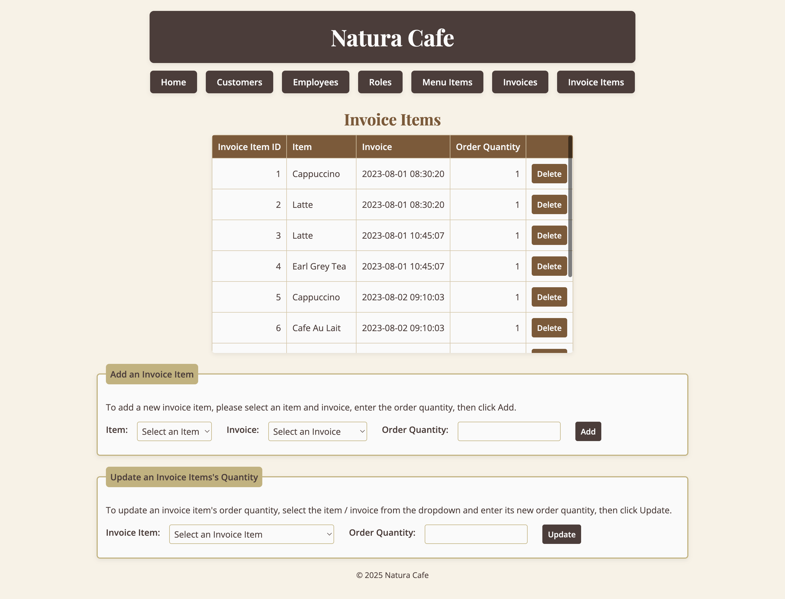
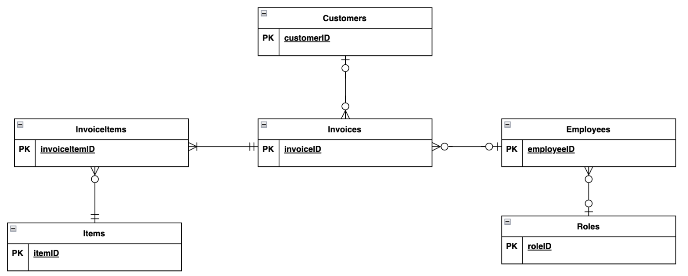
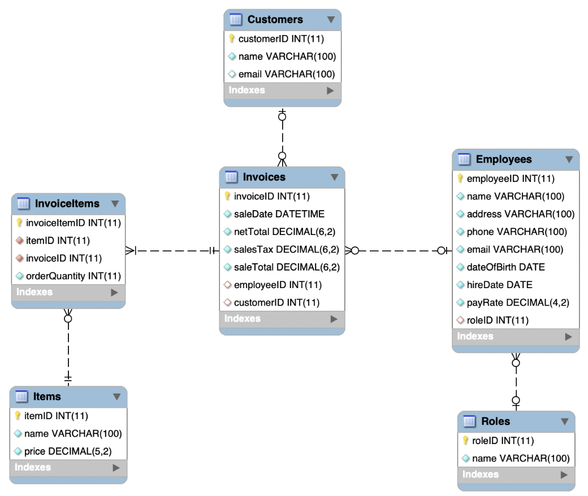

# Natura Cafe Sales and Operations Management System

## Overview
The Natura Cafe Sales and Operations Management System is a full-stack web application designed for a cafe. It streamlines operations by managing customers, employees, roles, menu items, and sales, with a modern, coffee-themed UI. Built by **Anna Kaza** as the primary developer, this project showcases my skills in database design, backend development, and frontend UI/UX.

- **Technologies:** MySQL, Node.js, Express, Handlebars, JavaScript, CSS  

## Features
- **Database**: MySQL with 6 tables (`Customers`, `Employees`, `Roles`, `Items`, `Invoices`, `InvoiceItems`), including a Many-to-Many relationship (`Invoices`-`Items` via `InvoiceItems`).  
- **CRUD Operations**: Add, update, and delete data with real-time updates via AJAX.  
- **UI/UX**: Modern, minimal design with a coffee-inspired palette, responsive tables, and intuitive forms.  
- **Documentation**: Includes Entity-Relationship Diagram (ERD), schema diagram, and detailed database outline.

## Screenshots and Demo
- **Homepage:**   
- **Customers Page:**   
- **Employees Page:**   
- **Roles Page:**   
- **Items Page:**   
- **Invoices Page:**   
- **InvoiceItems Page:**   
- **Demo Video:** [Watch Demo](docs/screenshots/demo.mp4)

## Database
- **Structure**: 6 tables with nullable and non-nullable foreign keys, indexes for performance, and a Many-to-Many relationship.  
- **Schema and Sample Data**: Defined in `database/natura_cafe_schema.sql`.  
- **DML Queries**: Planned queries (`SELECT`, `INSERT`, `UPDATE`, `DELETE`) with placeholders in `database/natura_cafe_dml.sql`, implemented dynamically in `app.js`.  
- **Documentation**:  
  - **Database Outline:** [Detailed Structure](docs/database-outline.md)  
  - **ERD:**   
  - **Schema Diagram:** 
  
## Setup and Usage
1. **Prerequisites**: MySQL, Node.js, npm
2. **Database Setup**:  
   - Run: `mysql -u youruser -p < database/natura_cafe_schema.sql`  
   - Replace `youruser` with your MySQL username.
3. **Web App Setup**:  
   - Navigate to the project directory: `cd natura-cafe-database`  
   - Install dependencies: `npm install`  
   - Configure `database/db-connector.js` with your MySQL credentials.  
   - Start the app: `npm start`  
   - Access at: `http://localhost:2037`
4. **Usage**: Use the navigation bar to manage data (e.g., add customers, update roles, create invoices).

## Contributions
- **Primary Developer:** Anna Kaza
- **Collaborator:** Ethan Duke (database planning, project reports, frontend support)

## Citations
1. **CS 340 Starter Guide:** Curry, M., and Safonte, D. (Feb 28, 2025). [Source code](https://github.com/osu-cs340-ecampus/nodejs-starter-app).

## Contact
- Connect with me at annakaza06@gmail.com or www.linkedin.com/in/anna-kaza